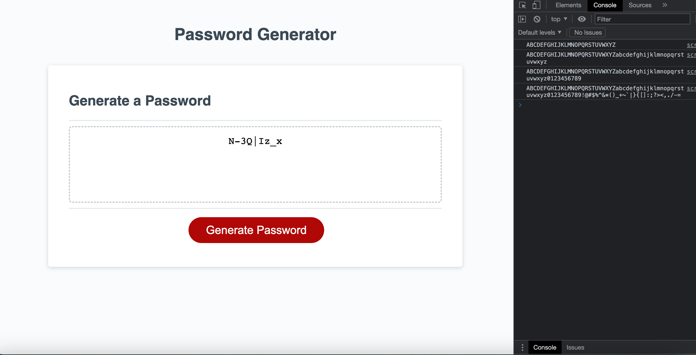

# Password-generator

## Description
* I updated the code given to me to generate a random password. First I wrote a general function of the questions and added all the characters together. Then I realized the assignment was to break down into questionaire asking the user how they would like their password to be generated. I created a while loop so that no matter how many times a user wanted to they had to chose atleast one of the following prompts for them to move on. Lastly the for loop I made was so the it would continuously randomize characters based on the users choices of length and specific chars.

## Github repo url
* https://github.com/silentprice/Password-generator

## Live URL
* https://silentprice.github.io/Password-generator/

## Screenshot
